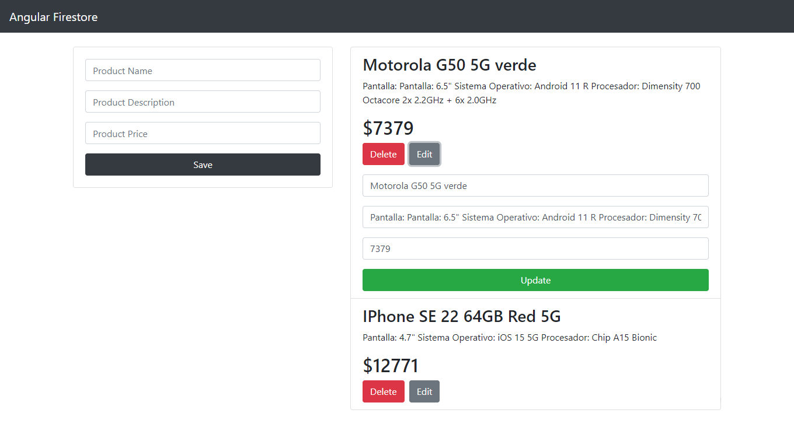

# angular-firestore-apicrud

Antes de comenzar debes tener instalado Visual studio Code, NodeJS, Git, TypeScript, Angular CLI y una cuenta en console.firebase.google.com

Pasos para arrancar el proyecto
1) Abrir una terminal de Git y clonar el proyecto con el comando: git clone https://github.com/RickZF/angular-firestore-apicrud.git
2) Crear un proyecto nuevo en Firebase y crear una colección con nombre "products" en Firestore Database 
3) Abrir la carpeta del proyecto con Visual Studio Code, ir a la carpeta src/environments y crear el archivo environment.ts 
4) Dentro del archivo environment.ts escribir el siguiente codigo y llenarlo con las respectivas claves del proyecto Firestore
  
  export const environment = {
  production: false,
  firebase: {
    apiKey: "",
    authDomain: "",
    projectId: "",
    storageBucket: "",
    messagingSenderId: "",
    appId: "",
    measurementId: ""
  }
};

5) Abrir una terminal con ctrl+shift+ñ y moverse a la carpeta client con el comando: cd client
6) En la ruta de la carpeta client escribir el comando: npm install
7) En la ruta de la carpeta client arrancar el servidor de Angular con el comando: ng serve
8) Abrir el navegador Chrome y en la barra de direcciones escribir http://localhost:4200/
9) Agregar productos a la base de datos
